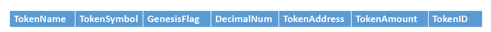
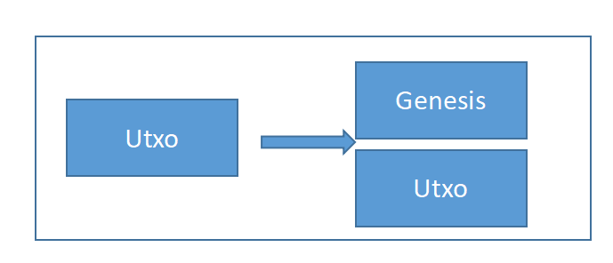
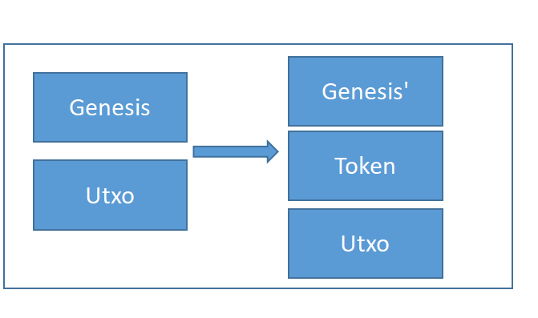
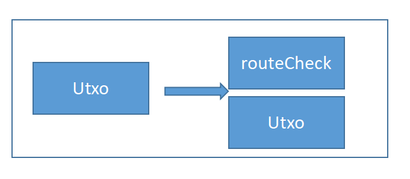
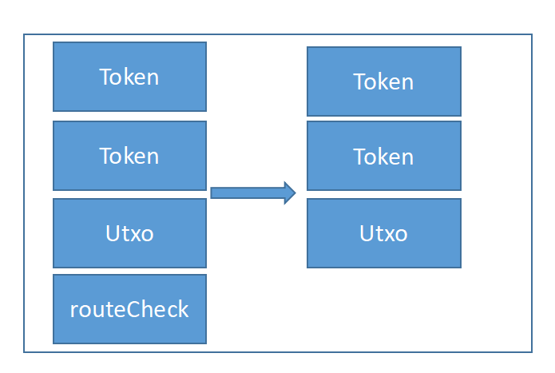

# token交易构造指引

## **1 创建Genesis**  

### **1.1 生成genesis的合合约**

创建genesis合约需要两个参数。
```
contract TokenGenesis {
  PubKey pubKey;
  int[3] rabinPubKeyArray;
```
>* pubKey，是发行者的公钥，创建token时需要使用对应的私钥对合约进行解锁。
>* rabinPubKeyArray，需要填入三个不同的rabin pubkey，后面解锁是需要至少两个pubkey对应的签名消息。

此外，还需要给TokenGenesis增加opreturn的数据，此数据为ft的定义标准数据。

### **Fungible Token数据格式**


>* oracle type: 4 bytes unsigned int
>* oracle flag: 'oraclesv'

token的数据格式定义



>* Token name，用于定义token名字，20字节，如果token名字不满20字节，用0x00填充。
>* Token Symbol, tokne的简称，10字节。 
>* Genesis flag是一个1字节的unsigned int，若等于1表示其为genesis合约，用于创建token。等于0则为普通token合约。
>* Decimal num，是1字节的unsigned int，用于表示token amount的小数位。 
>* Token address使用和bsv legacal address一样的数据格式，保持和bsv转账的一致性。同时也支持script hash。 
>* Token amount是一个8字节的小端存储的unsigned int, 代表token的数量。 
>* TokenID长度为36字节，是第一次生成的genesis utxo的outputpoint。用来标识不同的token。

### **Rabin Msg 格式**

rabin的签名方式可以参见[satotx](https://github.com/sensing-contract/satotx)。其中签名消息有两种格式：

>* 1. [对“某UTXO”签名](https://github.com/sensing-contract/satotx#1-%E5%AF%B9%E6%9F%90utxo%E7%AD%BE%E5%90%8D)
>* 2. [对“某UTXO被下一个Tx花费”签名](https://github.com/sensing-contract/satotx#2-%E5%AF%B9%E6%9F%90utxo%E8%A2%AB%E4%B8%8B%E4%B8%80%E4%B8%AAtx%E8%8A%B1%E8%B4%B9%E7%AD%BE%E5%90%8D)

### **1.2 创建Genesis Tx**



将genesis合约的锁定脚本作为tx一个输出的script，生成一个tx。tokenID也就确定为此输出的outputpoint。可在测试网上查看此类型[tx实例](https://test.whatsonchain.com/tx/f89053a1997e70412f455f72a02e76dba289608577505fff359d7ea62c7ba4eb)。

## **2 发行Token**

### **2.1 创建token合约**

token合约创建需要四个参数：
```
contract Token {
  int[3] rabinPubKeyArray;
  bytes[3] routeContractCodeHashArray;
  bytes[3] unlockContractCodeHashArray;
  bytes genesisContractHash
```

>* rabinPubkeyArray，与genesis合约里面用的参数一样。
>* routeContractCodeHashArray: 一个合约代码hash的数组，routeContract是用来转账时对输入输出的token数量进行检查。这里支持5种不同的合约，可以对于不同的输入输出使用不同的检查脚本，比如3输入3输入，6输入6输出，10输入10输出，20输入3输出，3输入20输出5种不同类型的合约，在合约转账时可以根据具体的需求，来选择生成不同的合约，能够灵活支持大规模的转账，同时控制token合约的size。
>* unlockContractCodeHashArray: 类似与routeContractCodeHashArray, 是在unlockFromContract时用于检查token输入输出数量是否匹配。需要注意的是，unlockFromContract在检查输入输出事，输入检查的是token输入数量，输出检查的是所有的输出包括非token的输出。因此tokenUnlockContractCheck合约里面的输出数量的限制，是该交易的所有输出数量的限制。
>* genesisContractHash: 是genesis合约的hash，用于增发时检测增发行为是否合法。在第一步生成genesis utxo的lockingScript，将其中的tokenID数据区段用真正的tokenID替换得到新的newLockingScript，然后使用sha256ripemd160(newLockingScript)得到hash值。

token合约生成后，需要设置token的data字段。

### **2.2 创建token合约tx**



将第一步生成的genesis utxo作为输入，生成新的genesis utxo，以及新的token utxo。新的Genesis'是用于之后增发新的token，如果不需要增发，则可以选择不输出Genesis'。可在测试网查看此类型[tx实例](https://test.whatsonchain.com/tx/8b4c8f101451e9a958e442d77d283cb82c218c2e36966adf01559a92c146d86f)。

### **genesis合约解锁**

合约解锁时，需要传入oracle的签名消息。我们再合约里面设置了3个不同的rabinPubKey，但是只需要2个oracle签名就可以解锁，因此解锁时只需要传入合约里面某2个rabin pubkey对应的签名信息即可。后面的合约rabin解锁方式都做同样的处理。

```
  public function unlock(
    SigHashPreimage txPreimage,
    Sig sig,
    bytes rabinMsg,
    bytes[2] rabinPaddingArray,
    int[2] rabinSigArray,
    int[2] rabinPubKeyIndexArray,
    int genesisSatoshis,
    bytes tokenScript,
    int tokenSatoshis,
    Ripemd160 changeAddress,
    int changeSatoshis
    ) {
```
>* txPreimage: preimage
>* sig: 发行者对tx的签名
>* rabinMsg: 对于此genesis合约的验证消息，使用第二种rabin消息格式。如果是第一次生成的genesis合约，则不需要验证，可以随便填写。后面的rabinPaddingArray,rabinSigArray也是一样。
>* rabinPaddingArray: 合约里面规定的rabin pubkey对上面的rabinMsg签名后的padding。
>* rabinSigArray: 合约里面规定的rabin pubkey对上面的rabinMsg签名后的sig
>* rabinPubKeyIndexArray: 传入的签名所对应的pubkey index。
>* genesisSatoshis: 输出新的genesis合约的satoshis，如果填0，则不会输出新的genesis合约, 意味着此token合约放弃增发。
>* tokenScript: 输出token的lockingScript
>* tokenSatoshi: 输出token的satoshis
>* changeAddress: 找零的address
>* changeSatoshis：找零的satoshis

## **3 token转账**

### **3.1 创建tokenRouteCheck合约**

合约创建需要rabinPubKeyArray
```
// opreturn + receiverTokenAmountArray + receiverArray + nReceivers(1 bytes) + tokenContractCodeHash +  tokenID
contract TokenRouteCheck {
  int[3] rabinPubKeyArray;
```
还需要为合约设置opreturn的data，具体内容为
```
 [
  nSenders（4 bytes）
  receiverTokenAmountArray
  receiverArray
  nReceivers(4 bytes)
  tokenCodeHash
  tokenID
 ]
 ```
 tokenContractCodeHash是token合约去除掉data部分后的sha256ripemd160 hash值。

### **3.2 创建routeCheck tx**

将创建的routeCheck合约的lockingScript放入一个输出的script中。可在测试网查看此类型[tx实例](https://test.whatsonchain.com/tx/e321d5ea44edb99231a7eb67fde664cd0a8e402d3c89ce9fc090eb2284e23646)。



### **3.3 创建token转账合约tx**



将需要转账的token作为输入，注意token输入必须是从input 0开始，然后连续排列。同时用3.2得到的routeCheck utxo也作为其中一个输入，注意其必须是放在input的最后，然后输出token以及找零的utxo可在测试网查看此类型[tx实例](https://test.whatsonchain.com/tx/d4643990952233445403f5ec050e96f491702fb60cb9b704009d50358e589f69)。

### **routeCheck解锁**

```
public function unlock(
    SigHashPreimage txPreimage,
    bytes tokenScript,
    bytes prevouts,
    bytes rabinMsgArray,
    bytes rabinPaddingArray,
    bytes rabinSigArray,
    int[2] rabinPubKeyIndexArray,
    bytes inputTokenAddressArray,
    bytes inputTokenAmountArray,
    bytes receiverSatoshiArray,
    int changeSatoshis,
    Ripemd160 changeAddress
  ) {
```
>* txPreimage：preimage。
>* tokenScript: 输入token utxo中任意一个输入的锁定脚本。
>* prevouts：prevouts。
>* rabinMsgArray：所有输入token的rabin msg array，按照token在tx中的输入顺序排列。这里使用的是第一种签名消息格式，对“某UTXO”签名。
>* rabinPaddingArray：输入msg的rabin签名padding array。按照token在tx中的顺序排列。<input 0> + <input 1> + ...。其中每个input i是由3个padding所组成，分别是3个rabinPubKey所对应的padding。
>* rabinSigArray: 输入msg的rabin签名。<input 0> + <input 1> + ...。类似于padding，每个input i也是由3个签名所组成，分别对应3个rabinPubKey。
>* rabinPubKeyIndexArray: 传入的签名所对应的pubkey index。
>* inputTokenAddressArray: 输入token的address array。
>* inputTokenAmountArray：输入token的amount array。
>* receiverSatoshiArray：输出token的output satoshis。
>* changeSatoshis: 找零satoshi。
>* changeAddress：找零地址。

### **token解锁**

```
  // operation: 1 transfer, 2 unlockFromContract
  public function unlock(
    SigHashPreimage txPreimage,
    int tokenInputIndex,
    bytes prevouts,
    bytes rabinMsg,
    bytes[2] rabinPaddingArray,
    int[2] rabinSigArray,
    int[2] rabinPubKeyIndexArray,
    int checkInputIndex,
    bytes checkScriptTx,
    int checkScriptTxOutIndex,
    int nReceivers,
    bytes prevTokenAddress,
    int prevTokenAmount,
    PubKey senderPubKey, // only transfer need
    Sig senderSig, // only transfer need
    int lockContractInputIndex, // only unlockFromContract need
    bytes lockContractTx, // only unlockFromContract need
    int lockContractTxOutIndex, // only unlockFromContract need
    int operation
  ) {
```

>* txPreimage: preimage。
>* tokenInputIndex: token输入中的第几个，从0开始计数。
>* prevouts: prevouts。
>* rabinMsg: 对于自己的utxo的前一个交易的签名消息。这是使用的是第二种rabin消息签名格式。
>* rabinPaddingArray：对于自己的rabin签名padding array。
>* rabinSigArray： 对于自己的rabin签名。
>* rabinPubKeyIndexArray: 传入的签名所对应的pubkey index。
>* checkInputIndex: routeCheck输入在tx中的input index。
>* checkScriptTx: 生成routeCheck的raw tx。
>* checkScriptTxOutIndex：routeCheck在生成tx中的output index。
>* nReceivers：tx中token输出的数量。
>* prevTokenAddress: rabin签名的交易token的address。
>* prevTokenAmount: rabin签名的交易tokne的amount。
>* senderPubKey: 发送者的公钥。
>* senderSig：发送者的签名。
>* lockContractInputIndex: 转账时不需要，填0。
>* lockContractTx: 转账时不需要，填b'00'。
>* lockContractTxOutIndex: 转账时不需要，填0。
>* operation：转账操作填1。